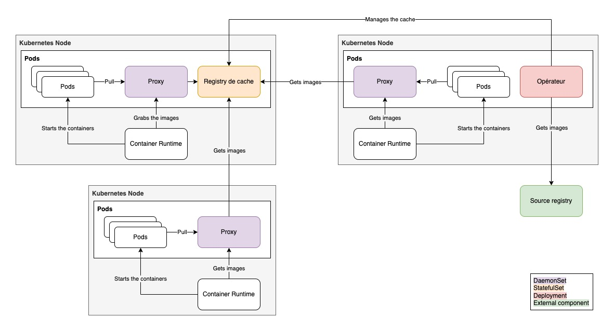

# kube-image-keeper (kuik, pronounce [kwɪk]!)

[](https://opensource.org/licenses/MIT)
[](https://enix.io)

Kube Image Keeper (a.k.a. *kuik*) is a container image caching system designed for Kubernetes.
It ensures the availability of your favorite container images by keeping a local copy within your k8s cluster.  

This is useful in various situation: 
- to avoid reaching your dockerhub (or any other rate-limited registry) pull quota
- if the registry is unavailable for some reason
- if your critical image is no longer available in the registry (deleted by mistake, inappropriate retention policy...)

## Prerequisities

- Kubernetes cluster up & running with admin permissions
- Helm >= 3.2.0
- [Cert-manager](https://cert-manager.io/docs/installation/) installed
- CNI plugin with [port-mapper](https://www.cni.dev/plugins/current/meta/portmap/) enabled

## Supported Kubernetes versions

Tested from v1.21 to v1.24 but should works on latest versions.

## How it works

kuik is composed of 3 main components:

- A mutating webhook responsible to rewrite pod's image name on the fly.
- A controller watching pods, that create a custom resource `CachedImage`.
- A controller watching `CachedImage` custom resources and fetching images from source registry and storing them to the local one.

In addition, we deploy:

- A container [registry](https://docs.docker.com/registry/) to store downloaded images.
- A proxy deployed as a DaemonSet reponsible to pull images from either the local or the source registry.



When a pod is scheduled, the mutating webhook will rewrite and prefix the image name with `localhost:{port}/` where `port` is configurable. 
The proxy hostPort setting allows the container runtime to pull images though it on localhost. The proxy will determine if the image should be retrieve either from the local or the source registry.  

## Installation

1. Customize your `values.yaml` to configure the chart.
1. Install the helm chart following one of the two below methods:

**From source:**

```bash
helm install --create-namespace --namespace kuik-system kube-image-keeper --values=./values.yaml ./helm/kube-image-keeper/
```

**From [enix/helm-charts](https://github.com/enix/helm-charts) repository:**

```bash
helm repo add enix https://charts.enix.io/
helm install --create-namespace --namespace kuik-system kube-image-keeper --values=./values.yaml enix/kube-image-keeper
```

## Usage 

### Pod filtering

There are 3 ways to filter pods from which images should be cached.

- The first and most basic way is to add the label `kube-image-keeper.enix.io/image-caching-policy: ignore` on pods that should be ignored.
- The second way is to define the value `controllers.webhook.objectSelector.matchExpressions` in helm `values.yaml` configuration file.
- Last, you can ignore all pods scheduled in a specific namespace using the directive `controllers.webhook.ignoredNamespaces` (This feature needs [NamespaceDefaultLabelName](https://kubernetes.io/docs/concepts/services-networking/network-policies/#targeting-a-namespace-by-its-name) feature gate enabled to work).

Those parameters are used by the `MutatingWebhookConfiguration` to filter pods that needs to be updated. Once images from those pods are rewritten, a label will be added to them so the Pod controller will create CachedImages custom resources. The CachedImages controller will then cache those images.

### Cache persistance & garbage collecting

Persistance is disabled by default. It requires a CSI plugin to be installed on the cluster to be enabled. It is then configured through the `values.yaml` helm release configuration file in `registry.persistance`.

When a CachedImage expires because it is not used anymore by the cluster, the image is deleted from the registry. But it only delete **reference files** like tags, not blobs that accounts for the most storage usage. [Garbage collection](https://docs.docker.com/registry/garbage-collection/) allows to remove those blobs and free space. The garbage collecting job can be configured to run thanks to the `registry.garbageCollectionSchedule` configuration in a cron-like format. It is disabled by default as running garbage collection without persistency configured would just empty the cache registry as described in the below section.

## ⚠️  Limitations

Garbage collection can only run when the registry is read-only or not running at all to prevent corrupted images as described in the [documentation](https://docs.docker.com/registry/garbage-collection/). Thus, when the garbage collection job runs, it first stops any running instance of the cache registry before doing garbage collection. During this period of time, all pulls are proxified to the source registry so operation can continue smoothly.

Be careful, running garbage collection while not having persistance configured would simply empty the cache registry since its pod is destroyed during the operation and it is thus not recommanded for production setups.
