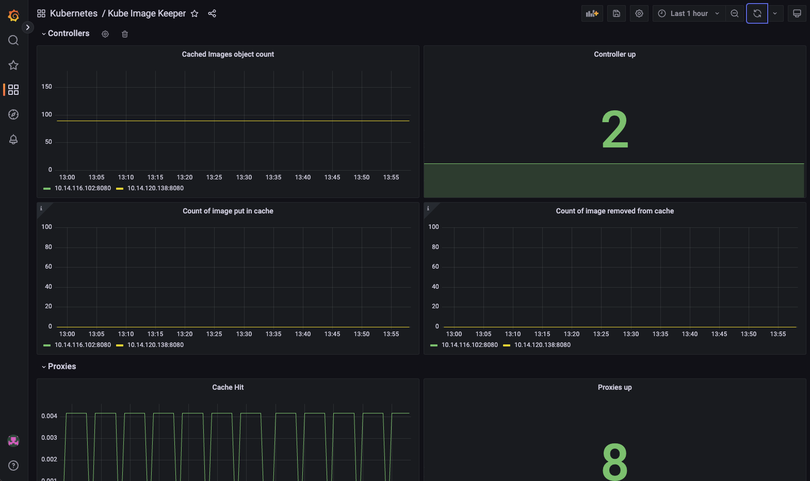

# Monitoring & Metrics

To assist with operations and provide a visualization of kube-image-keeper activities, Prometheus metrics are exposed from the three components (proxy, controller and registry).

If you're using [Prometheus Operator](https://prometheus-operator.dev/) (for instance as part of [kube-prometheus-stack](https://artifacthub.io/packages/helm/prometheus-community/kube-prometheus-stack), and deploying kuik with Helm, you can create PodMonitor and ServiceMonitor resources by setting the following values:
- `controllers.podMonitor.create=true`
- `proxy.podMonitor.create=true`
- `registry.serviceMonitor.create=true`

And if you enabled minio to provide an S3-compatible storage for the registry, you can scrape its metrics as well with a ServiceMonitor by setting the following value:
- `minio.metrics.serviceMonitor.enabled=true`

## Exposed Metrics

### Controller

| Metric | Description |
|--------|-------------|
| kube_image_keeper_controller_build_info | Provide informations about controller version |
| kube_image_keeper_controller_cached_images | Count of all cached images expired or not |
| kube_image_keeper_controller_containers_with_cached_image | Number of containers that have been rewritten to use a cached image |
| kube_image_keeper_controller_image_caching_request | Number of request to cache an image |
| kube_image_keeper_controller_image_put_in_cache_total | Count of all cached images since controller start |
| kube_image_keeper_controller_image_removed_from_cache_total | Count of all images removed from the cache since controller start |
| kube_image_keeper_controller_is_leader | Return 1 if the pod is leader |
| kube_image_keeper_controller_repositories | Number of repositories |
| kube_image_keeper_controller_up | Return 1 if the controller is running |

By default, two replicas of the controller are running, and one of them becomes the leader. The value of `cached_images` should be the same across all replicas. However, the values for `put_in_cache` and `removed_from_cache` will increase only for the leader controller. They get reset to zero when the controller restarts, so they should mostly be used as "sign of life", or e.g. to detect when no images get removed from the cache even over multiple weeks or months.

### Proxy

| Metric | Description |
|--------|-------------|
| kube_image_keeper_proxy_build_info | Provide informations about proxy version |
| kube_image_keeper_proxy_http_requests_total | Provide information about cache hit and http requests |

### Registry

These metrics are exposed by the Docker Registry itself, more details in the official [documentation](https://docs.docker.com/registry/configuration/#debug)

## Grafana Dashboard

We provide a Grafana dashboard available [in this repository](./kube-image-keeper.dashboard.json) or [on GrafanaLabs](https://grafana.com/grafana/dashboards/19023-kube-image-keeper/). 

